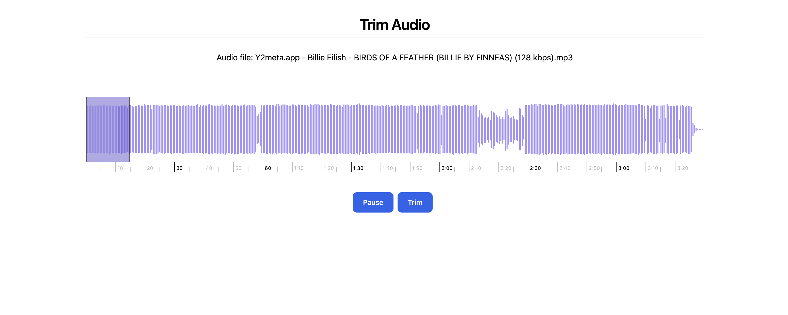

# Audio Trimmer React App

This React application allows users to trim audio files using FFmpeg for processing and Wavesurfer for visualization.



## Features

- Upload audio files
- Visualize audio waveforms
- Trim audio files
- Download trimmed audio

## Installation

1. Clone the repository:

   ```
   git clone https://github.com/muhemmedirfanc/react-audio-trimmer.git
   ```

2. Navigate to the project directory:

   ```
   cd react-audio-trimmer
   ```

3. Install the dependencies:
   ```
   npm install
   ```

## Usage

1. Start the development server:

   ```
   npm run dev
   ```

2. Open your browser and visit `http://localhost:5173`

3. Upload an audio file, use the waveform to select the portion you want to trim, and export the result.

## Dependencies

- [React](https://reactjs.org/)
- [FFmpeg](https://ffmpeg.org/)
- [Wavesurfer.js](https://wavesurfer-js.org/)

## License

This project is licensed under the MIT License - see the [LICENSE.md](LICENSE.md) file for details.
